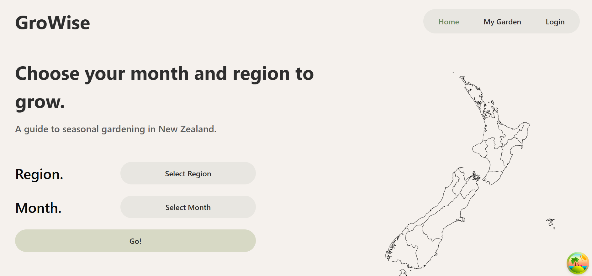
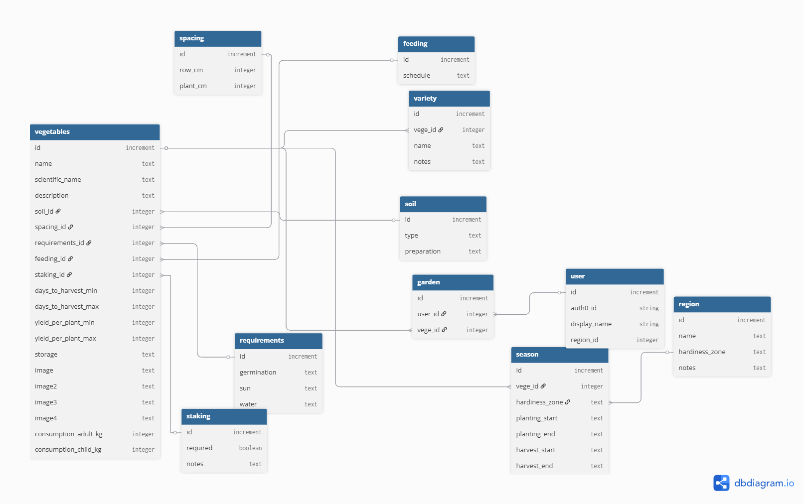
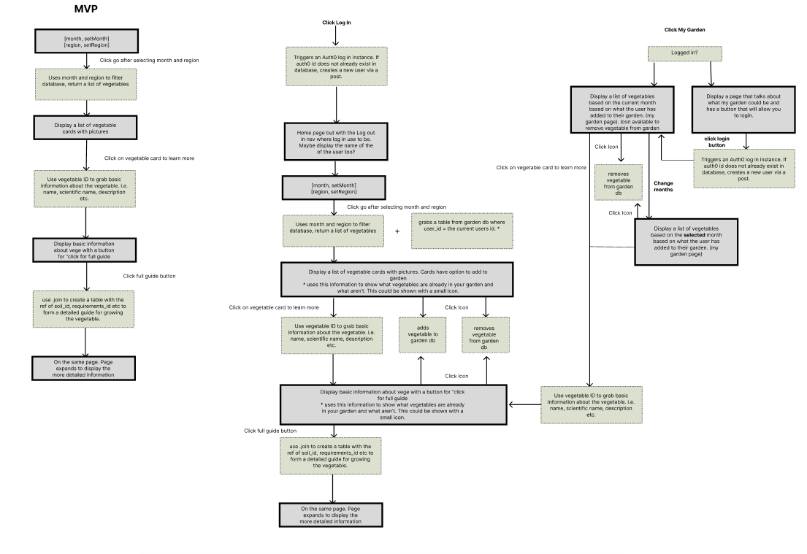

## Kia ora, I'm Angu 👋
I am a Full-Stack Developer, focused on creating solutions to real world problems. I believe the future is what we make it and that is why I love working on projects that align with my values and have a social impact. I come from a background of Mechatronics Engineering but decided to switch to Full Stack Development after coming to terms about how much I have always enjoyed programming. After completing DevAcademy Aotearoa in 2025, I am now seeking full stack software development opporunities. 

If you are looking for a life learner, great communicator and an awesome teammate, lets get connected!

## Current Project
###  Kakī Data Logger
The Kakī Data Logger was developed following discussions with a conservation team based in Twizel. The team relied on a free, spreadsheet-style application to record field data, but it had become increasingly buggy and slow, impacting usability in the field.

I proposed and built a replacement full-stack application that preserves the original data-entry workflow while adding improved performance, data visualisation, and a more intuitive user interface. The application enables the storage and visualisation of field observations, including sightings, pairings, and releases.

Due to the sensitive nature of conservation data, all seed data in the public repository is fictional. Prior to real-world deployment, the project will be cloned into a private repository before introducing any sensitive information.

## Past Porjects
### 🌱 GroWise
Our final group project during the bootcamp of DevAcademy Aotearoa. This was completed in a team of 5 in just under 2 weeks part-time. Our group develeoped a NZ seasonal growing web based applciation called grow [GroWise](https://github.com/angu-chen/groWise-web). 

Growise allows the end user to choose a region and month and then outputs the plants to plant during that month. Users can save plants to their own garden to look up later. 

### Responsibilities
Along with completing full stack tickets, I was deeply invovled in the initial planning of the database (DB) structure. The DB is normalised.

I created a website architecture flow to ensure that our team was aligned with how everything should work and it became the first step we referenced to when completing tickets. 

### LoopedIn
This was a fun group project during bootcamp at DecAcademy where we made a social media themed web site. LoopedIn was thought up as a place to connect to different social groups and stay "looped in".
[LoopedIn Repo](https://github.com/angu-chen/loopedin)

#### Stack

